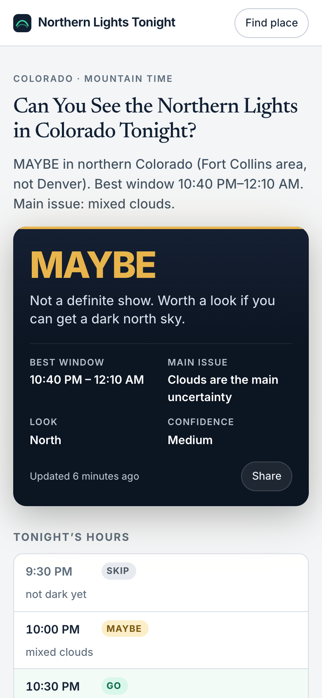
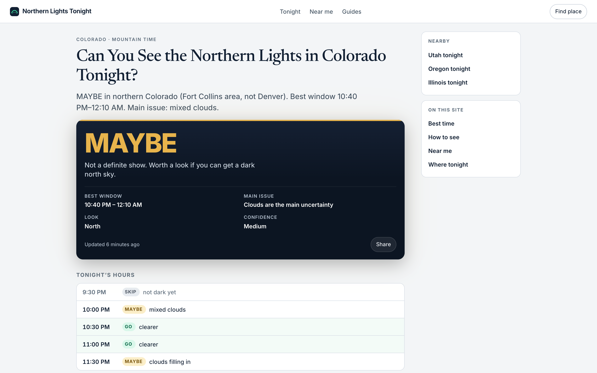
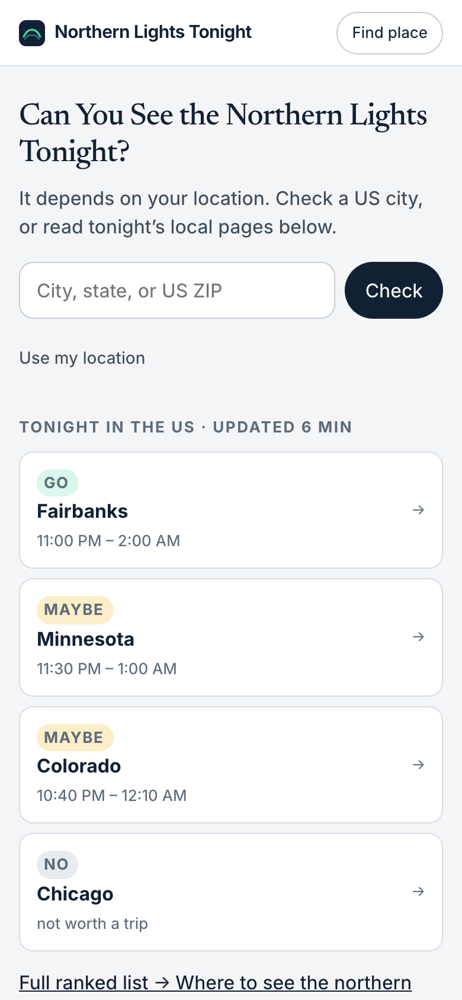
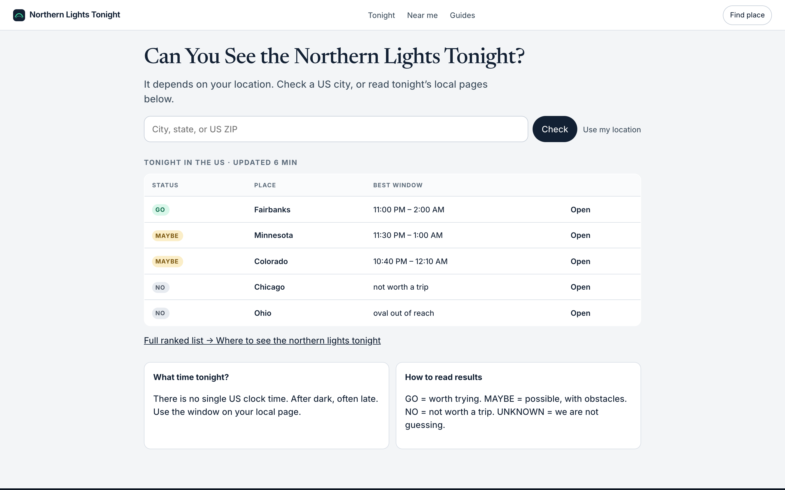
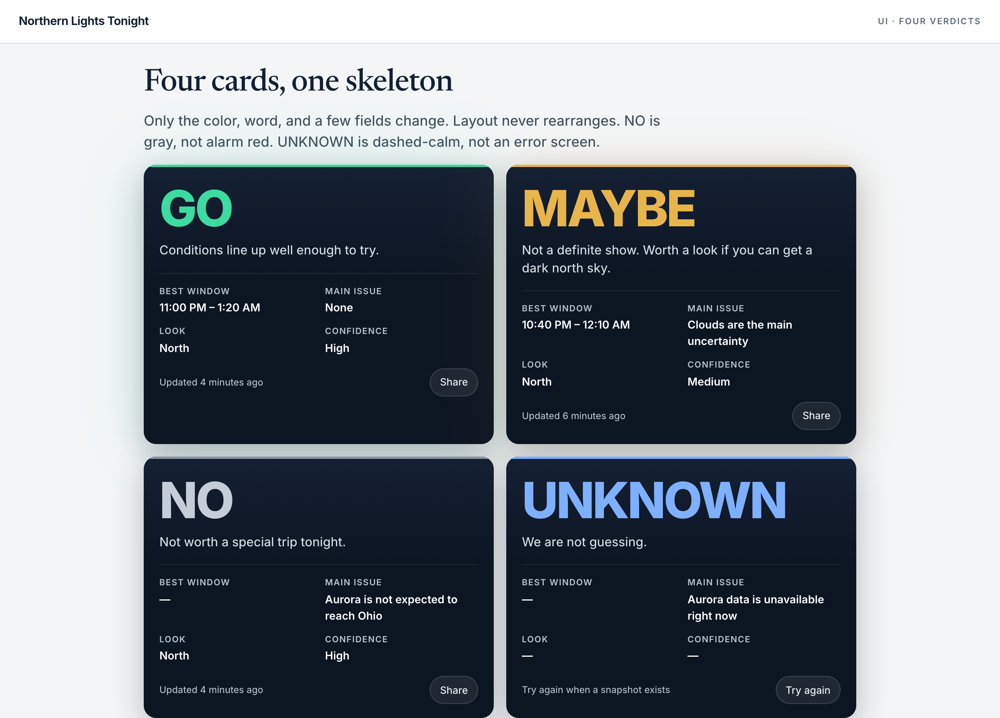

<b>视觉方向</b>：夜里的决定，白天的文章。不要仪表盘，不要极光海报。

<b>钱页第一屏</b>：H1 问句 + 答案段 + 夜色结论卡。手机不滚动就能看见 MAYBE/GO/NO。

<b>不改</b>：URL、模块顺序、四态、SSR 结论必须在 HTML。

静态视觉稿在仓库 <code>视觉稿/</code>，不是生产页。

## 1. 为什么这样

搜 tonight 的人很多是下午在办公室，不是夜里在野地。整页 OLED 黑白天刺、FAQ 也累。SpaceWeatherLive 那种 Kp 仪表盘，和旅游站的极光大图，都不该学。

这个产品的瞬间是四个词：<b>GO / MAYBE / NO / UNKNOWN</b>。所以页面劈成两层：

<table>
<thead>
<tr>
<th background-color="rgb(230,218,254)">层</th>
<th background-color="rgb(230,218,254)">气质</th>
<th background-color="rgb(230,218,254)">用在哪</th>
</tr>
</thead>
<tbody>
<tr>
<td>白天</td>
<td>浅灰纸、白卡片、衬线标题</td>
<td>顶栏、H1、搜索、15 行表、Why、FAQ、指南</td>
</tr>
<tr>
<td>夜里</td>
<td>海军底、巨大状态词、一点极光绿</td>
<td><b>只有结论卡</b>（页脚用夜色收口）</td>
</tr>
</tbody>
</table>

备选全站暗色更像竞品工具，v1 不推荐。

## 2. 钱页（手机 · 第一屏）

浅底问句，夜窗出结论。状态词是视觉主角色，H1 不是。

## 3. 钱页（桌面）

主栏约 680 + 右栏 240。Nearby 粘性，不替代小时轴和 Why。

## 4. 首页枢纽

所有人同一份 HTML。搜索是转化，15 行表是 SEO 主体。不要 IP 结论卡。

手机改成可点卡片：

桌面用表：

## 5. 四态只换皮，骨架不动

NO 用冷灰，不用报警红。UNKNOWN 是冷静，不是报错屏。红只留给 GPS 失败 / 500。

## 6. UI 规范（落地时按这个）

### 颜色

<table>
<thead>
<tr>
<th background-color="rgb(218,229,255)">Token</th>
<th background-color="rgb(218,229,255)">Hex</th>
<th background-color="rgb(218,229,255)">用途</th>
</tr>
</thead>
<tbody>
<tr><td>ink</td><td><code>#122033</code></td><td>正文、字标、主按钮</td></tr>
<tr><td>paper</td><td><code>#F3F5F7</code></td><td>页底</td></tr>
<tr><td>night</td><td><code>#0C1522</code></td><td>结论卡、页脚</td></tr>
<tr><td>aurora</td><td><code>#3CDBA0</code></td><td>GO、焦点环、小标志</td></tr>
<tr><td>maybe</td><td><code>#E8B44C</code></td><td>MAYBE</td></tr>
<tr><td>no</td><td><code>#8A93A3</code></td><td>NO</td></tr>
<tr><td>unknown</td><td><code>#7EB0FF</code></td><td>UNKNOWN</td></tr>
<tr><td>danger</td><td><code>#E25B4C</code></td><td>真错误</td></tr>
</tbody>
</table>

颜色不单独表示状态：必须「词 + 色 + 胶囊」。

### 字体

- UI / 状态词 / 表：<b>Inter</b>
- H1 问句：<b>Newsreader</b>（杂志夜报，不是仪表盘）
- 不要太空 / 霓虹 / 手写体

### 字号

<table>
<thead>
<tr>
<th background-color="rgb(230,218,254)">角色</th>
<th background-color="rgb(230,218,254)">手机</th>
<th background-color="rgb(230,218,254)">桌面</th>
</tr>
</thead>
<tbody>
<tr><td>H1 问句</td><td>26</td><td>40</td></tr>
<tr><td>状态词</td><td>44–48</td><td>64</td></tr>
<tr><td>正文</td><td>16</td><td>16</td></tr>
<tr><td>导语</td><td>16</td><td>18</td></tr>
</tbody>
</table>

### 尺寸

- 网格 8。页边 16 / 桌面 24。
- 顶栏 56。按钮和输入最小 44 高。
- 卡片圆角 16，输入 12，胶囊 999。
- 动效 ≤ 200ms。不要循环发光。无粒子、无库存极光、无地图、无百分环。

### 组件要点

- <b>结论卡</b>：上沿 3px 状态色条 → 大词 → 人话 → 四格 meta → Updated + Share。四态骨架相同。
- <b>小时轴</b>：列表不是图。SKIP 变灰。GO 行淡绿底。默认约 5 行。
- <b>Find place</b>：手机底栏 sheet，桌面按钮下弹出。不要居中大模态挡住第一屏。
- <b>焦点</b>：2px aurora 绿。关 CSS 仍能读到状态和窗口。

## 7. 不要做

<b>不要</b>：库存极光英雄图、WebGL 粒子、Kp 仪表、百分数、热力地图、NO 用红、广告插在 H1 和卡之间、用客户端把结论「画出来」才出现。

实现时 CSS 变量一次写进全局；卡用 <code>data-status="maybe"</code>，不要做四套组件。视觉只换皮肤，线框顺序仍冻结。
