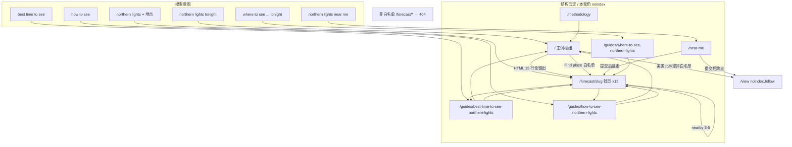
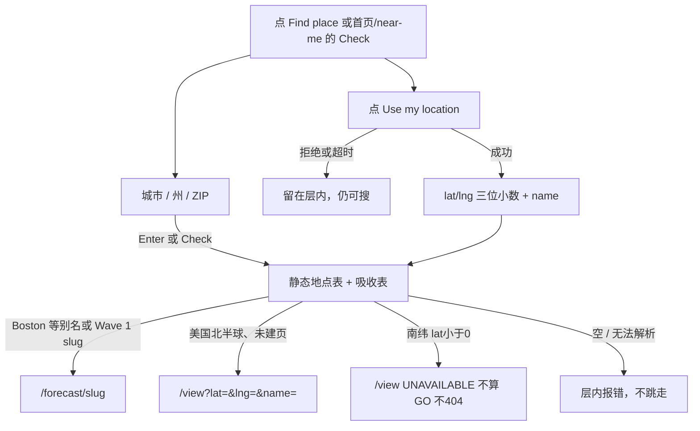
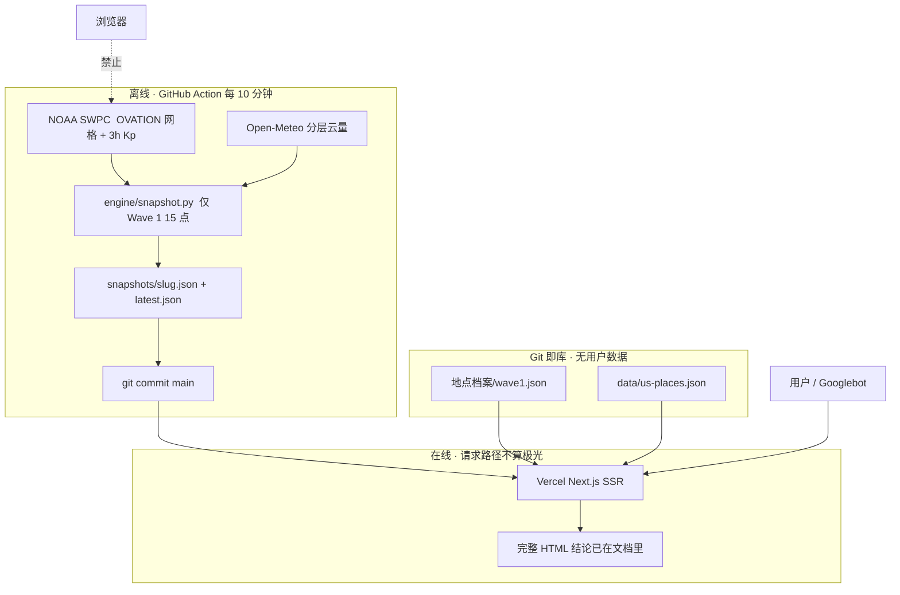
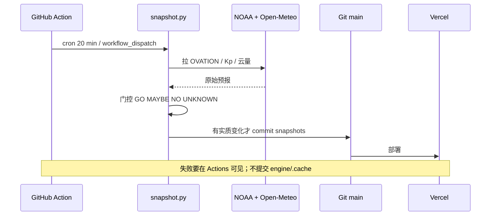
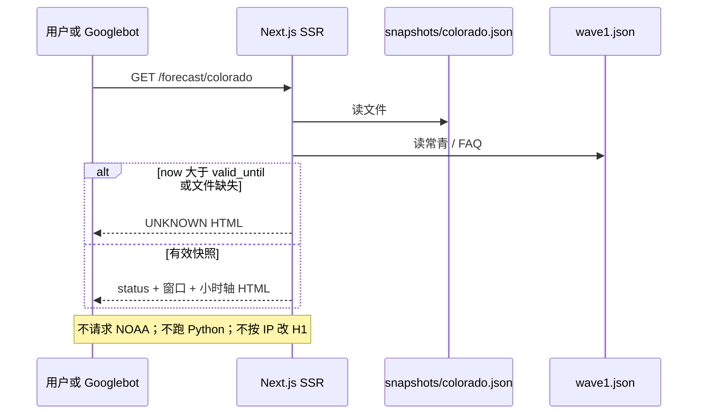

# 设计｜v1 页面架构 · 线框交互 · 后端 · 主打词

**给谁：** 产品审阅（本篇）→ 通过后再交给 Codex 按 `需求｜v1-Codex实现.md` 实现  
**日期：** 2026-08-21  
**约束：** 不写 HTML。本轮全站 noindex。登录 / 用户库 / `/map` 不做。  
**词量：** Semrush 导出 `2026-07-18`；地点主打词取自 `地点档案/wave1.json` 的 `primary_keyword`。

冲突时仍以实现合同冻结条款为准：`/view` 无快照只 UNKNOWN；非 Wave 1 的 `/forecast/[slug]` 一律 404；IP 不进 SSR。

---

## 1. 前端页面架构

站不是天气 App。搜索进不同 URL；钱页是 15 个 `/forecast/[slug]`。首页只做主词枢纽，把权用 HTML 链分出去。



### 1.1 URL 与模板（不是 15 套独立前端）

| URL | 模板 | 索引本轮 | 第一任务 |
|---|---|---|---|
| 全站壳 + Find place | `Shell` | — | 找地点，无账号 |
| `/` | `HomeHub` | noindex | 不靠定位回答「取决于地点」+ 15 行表 |
| `/forecast/[slug]` 州 | `TonightLocalState` | noindex | 今晚出不出门 |
| `/forecast/[slug]` 城 | `TonightLocalCity` | noindex | 同上，强调出城 |
| `/forecast/alaska` | `TravelPlusState` | noindex | 今晚卡 + 何时来 / 去哪一段 |
| `/forecast/fairbanks` | `TravelPlusCity` | noindex | 这座城今晚 |
| `/near-me` | `NearMeTool` | noindex | 解析地点后跳走 |
| `/view` | `LiveReading` | noindex,follow | 给结论，不建百科 |
| `/guides/where-to-see-northern-lights` | `GuideWhere` | noindex | 今晚榜 + 常驻 vs 事件 |
| `/guides/best-time-to-see-northern-lights` | `GuideArticle` | noindex | 年 / 夜 / 纬度 |
| `/guides/how-to-see-northern-lights` | `GuideArticle` | noindex | 朝北、暗、等、读状态 |
| `/methodology` | `GuideArticle` | noindex | 怎么判定 |
| `/forecast/{非白名单}` | `NotFound` | — | 404，不改写 |

没有：`/map`、`/login`、`/account`、`/places/*`、后台。

州模板 slug：colorado ohio indiana michigan wisconsin massachusetts maine minnesota illinois oregon utah alaska。  
城模板 slug：chicago seattle fairbanks。alaska / fairbanks 叠加旅行块。

### 1.2 组件分层

```
Shell
  Header   字标 / Tonight / Near me / Guides / Find place
  Overlay  Find place 层（每页共用）
  Footer   文字链（给手机和爬虫）
Page body（按模板换）
  PlaceSearchForm     首页、near-me 内嵌同一套
  USTonightTable      首页 15 行；Where 页分组榜同源
  VerdictBlock        H1 下答案段 + 结论卡（forecast / view）
  HoursAxis           30 分钟槽
  WhyList             到达 / 云 / 黑暗 / 月 / 城光 / 数据
  WhatToDo            档案 leave_city_advice
  OtherPoints         仅州页 sample points
  NearbyList          只链 Wave 1
  LocalFaq            档案 local_faqs + FAQPage
  Evergreen           档案常青；Alaska 换成 When to come
```

结论、15 地表、小时轴必须在 **SSR HTML**。浏览器不打 NOAA，也不靠 `/api/snapshots/latest` 才画出状态。

---

## 2. 全站交互：Find place（所有页同一套路由）

```
┌──────────────────────────────────────────────────────────────────────┐
│  Northern Lights Tonight     Tonight   Near me   Guides   Find place │
└──────────────────────────────────────────────────────────────────────┘

        ┌─────────────────────────────────────────────┐
        │  Find a place                            [x]│
        │  ┌───────────────────────────────────────┐  │
        │  │ City, state, or US ZIP                │  │
        │  └───────────────────────────────────────┘  │
        │  [ Use my location ]              [ Check ] │
        │  Colorado  Ohio  Chicago  Seattle  ...      │
        └─────────────────────────────────────────────┘
```

- **Layout:** 顶栏 56px。无账号按钮。层宽约 420px，居中。
- **响应式:** <768 顶栏只留字标 + Find place；Tonight / Near me / Guides 进页脚。层改底栏全宽。



| 元素 | 动作 | 结果 |
|---|---|---|
| 字标 | 点击 | `/` |
| Tonight | 点击 | `/` |
| Near me | 点击 | `/near-me` |
| Guides | 点击 | `/guides/best-time-to-see-northern-lights`（第一篇；页脚仍列三篇） |
| Find place | 点击 | 打开层；Esc / [x] / 遮罩关闭 |
| 输入框 | Enter | 等同 Check |
| Use my location | **点击后**才 `geolocation` | 成功则走路由；拒绝不弹第二次，搜索框仍在 |
| Check | 提交 | 见路由表，**不改当前页 H1** |
| Wave 1 快捷名 | 点击 | 直接 `/forecast/[slug]` |
| 非法 `/forecast/boston` 直打 | 地址栏 | **404**，不内部改写 |

吸收（禁止新 URL）：Boston→massachusetts，Minneapolis/Duluth→minnesota，Columbus→ohio，Indianapolis→indiana，Salt Lake City→utah，Northern Michigan→michigan。

IP 最多预填搜索框且可改。**禁止**用 IP 改 SSR / H1 / OG / JSON-LD / 结论卡。

---

## 3. 逐页：主打词 + 线框 + 交互

每页只打一个主意图。副词进同一 URL，不新开页。

### 3.1 `/` 首页 · 主词枢纽

**主打词：** `northern lights tonight`（135,000，KD 42）  
**兼收：** `can i see the northern lights tonight`（6,600）；`what time is the northern lights tonight`（5,400）——用「没有全美统一时刻 + 15 行窗口」接住，不另开 what-time URL。  
**不抢：** near me、where、某城 tonight。

Title：`Northern Lights Tonight: US City and State Aurora Forecast`  
H1：`Can You See the Northern Lights Tonight?`

```
┌──────────────────────────────────────────────────────────────────────┐
│  Northern Lights Tonight     Tonight   Near me   Guides   Find place │
├──────────────────────────────────────────────────────────────────────┤
│  Can You See the Northern Lights Tonight?                            │
│  It depends on your location. Check a US city, or read               │
│  tonight's local pages below.                                        │
│                                                                      │
│  ┌────────────────────────────────────┐  ┌────────┐                  │
│  │ City, state, or US ZIP             │  │ Check  │                  │
│  └────────────────────────────────────┘  └────────┘                  │
│  [ Use my location ]                                                 │
│                                                                      │
│  Tonight in the US                                   Updated 6 min   │
│  ┌─────────┬───────────────┬────────────────────┬──────┐             │
│  │ Status  │ Place         │ Best window        │      │             │
│  ├─────────┼───────────────┼────────────────────┼──────┤             │
│  │ GO      │ Fairbanks     │ 11:00 PM – 2:00 AM │ Open │             │
│  │ MAYBE   │ Minnesota     │ 11:30 PM – 1:00 AM │ Open │             │
│  │ NO      │ Chicago       │ not worth a trip   │ Open │             │
│  │ ... all 15 Wave 1 rows in the HTML ...              │             │
│  └─────────┴───────────────┴────────────────────┴──────┘             │
│  Full ranked list → Where to see tonight                             │
│                                                                      │
│  What time tonight?              How to read GO / MAYBE / NO         │
│  No single US clock.             GO = worth trying                   │
│  After dark, often late.         MAYBE = possible                    │
│                                  NO = not worth a trip               │
│                                  UNKNOWN = we are not guessing       │
├──────────────────────────────────────────────────────────────────────┤
│  Tonight · Near me · Guides · How we decide · Not affiliated NOAA    │
└──────────────────────────────────────────────────────────────────────┘
```

- **Layout:** 内容宽 ~960px。H1 → 无地点答案 → 搜索 → **全量 15 行表（SEO 主体）** → 两列说明 → 指南链。
- **Interactions:**

| 元素 | 动作 | 结果 |
|---|---|---|
| Check / GPS | 提交 | 只跳 forecast 或 view，**本页 HTML 不变** |
| 表行 / Open | 点击整行 | `/forecast/[slug]` |
| Where 链 | 点击 | where 指南 |
| What time 区 | 无控件 | 文案引导去各地页窗口 |

- **响应式:** 表改成可点卡片：状态 + 地名 + 窗口。说明两列改上下堆。
- **状态:** 无快照 / 过期 → 15 行全是 UNKNOWN，H1 和「取决于地点」仍在首份 HTML。无 loading 空白壳。

---

### 3.2 `/forecast/[slug]` 州页（示意 colorado）

**主打词：** 该 slug 的 `primary_keyword`（colorado = `northern lights colorado`，12,100，KD 18）  
**兼收：** `[place] tonight` / `aurora borealis [place]`（同一 URL）  
**不抢：** 州内城市另开索引页（Denver、Boston、Minneapolis 等只做代表点或吸收）。

Title：`Northern Lights in Colorado Tonight: Visibility & Best Time`  
H1：`Can You See the Northern Lights in Colorado Tonight?`

```
┌──────────────────────────────────────────────────────────────────────┐
│  Northern Lights Tonight     Tonight   Near me   Guides   Find place │
├──────────────────────────────────────────────┬───────────────────────┤
│  Can You See the Northern Lights             │  Nearby               │
│  in Colorado Tonight?                        │  Utah · Oregon        │
│                                              │  Best time · How to   │
│  MAYBE in northern Colorado                  │                       │
│  (Fort Collins area, not Denver).            │                       │
│  Best window 10:40 PM – 12:10 AM.            │                       │
│  Main issue: mixed clouds.                   │                       │
│                                              │                       │
│  ┌────────────────────────────────────────┐  │                       │
│  │ MAYBE                                  │  │                       │
│  │ Not a definite show. Worth a look      │  │                       │
│  │ if you can get a dark north sky.       │  │                       │
│  │ Best window   10:40 PM – 12:10 AM      │  │                       │
│  │ Main issue    Clouds are the           │  │                       │
│  │               main uncertainty         │  │                       │
│  │ Look north · Medium · Updated 6 min    │  │                       │
│  │ [ Share ]                              │  │                       │
│  └────────────────────────────────────────┘  │                       │
│  Tonight's hours                             │                       │
│  9:30 PM   —       not dark yet              │                       │
│  10:00 PM  MAYBE   mixed clouds              │                       │
│  10:30 PM  GO      clearer                   │                       │
│  [ Rest of the night ]                       │                       │
│  Why this verdict                            │                       │
│  What to do · Other points                   │                       │
│  Fort Collins MAYBE · Denver NO              │                       │
│  In this state · Local FAQ                   │                       │
├──────────────────────────────────────────────┴───────────────────────┤
│  Home · Near me · Best time · How to see                             │
└──────────────────────────────────────────────────────────────────────┘
```

手机第一屏（钱页硬条件：不滚动看到 H1 + 卡）：

```
┌──────────────────────────────────┐
│ NLT                    Find place│
├──────────────────────────────────┤
│ Can You See the Northern Lights  │
│ in Colorado Tonight?             │
│ MAYBE in northern Colorado       │
│ (Fort Collins area, not Denver). │
│ ┌──────────────────────────────┐ │
│ │ MAYBE  10:40 PM–12:10 AM     │ │
│ │ Clouds · North · [ Share ]   │ │
│ └──────────────────────────────┘ │
│ Tonight's hours  (可跨折页)       │
└──────────────────────────────────┘
```

- **Layout:** 主栏 640–680px；右栏 240px 桌面粘性。模块顺序冻结：答案段 → 卡 → 小时轴 → Why → What to do → Other points → In this state → Nearby → FAQ → 指南。Oregon 首屏代表点是 **Baker City**，不是 Portland。
- **Interactions:**

| 元素 | 动作 | 结果 |
|---|---|---|
| Share | 点击 | Web Share；否则复制 `{Place} tonight: {STATUS} · {window}` |
| Rest of the night | 展开 | 显示其余 30 分钟槽；默认约 5 行 |
| Other points 行 | 不可点成新 URL | 只展示 Denver 等，不生成 `/forecast/denver` |
| Nearby | 点击 | 另一个 Wave 1 `/forecast/[slug]` |
| FAQ | 手风琴可有 | 问句仍在 SSR HTML（FAQPage） |
| 过期快照 | 进入页 | 卡变 UNKNOWN，禁止显示旧 GO |

- **状态:** GO / MAYBE / NO / UNKNOWN 只换卡与答案段，骨架不变。无快照：卡 UNKNOWN，常青/FAQ 仍渲染。

---

### 3.3 `/forecast/[slug]` 城页（示意 chicago）

**主打词：** `northern lights chicago`（9,900，KD 24）  
同州页骨架，**删除** Other points / In this state。What to do 强调离开市区。Nearby：illinois / indiana / wisconsin / michigan。

---

### 3.4 `/forecast/alaska`

**主打词：** `northern lights alaska`（9,900，KD 49）  
**兼收：** `best places to see aurora in alaska`（14,800）；`best time to see northern lights in alaska`（2,900）——写进 When to come / Which part，**不另开** `/places/alaska`。  
**不抢：** Fairbanks 专名。

结论卡限定语必须出现：`statewide, headline: Fairbanks Interior`。其后：

```
│  When to come                                                        │
│  Late August – mid-April. June is usually a darkness no.             │
│                                                                      │
│  Which part of Alaska                                                │
│  Interior (Fairbanks)   best default                      Open →     │
│  Anchorage              compromise                                   │
│  Juneau                 rain, not Kp                                 │
```

| 元素 | 动作 | 结果 |
|---|---|---|
| Interior Open | 点击 | `/forecast/fairbanks` |
| Anchorage / Juneau | 不可变索引页 | 文案对比；需要坐标则 `/view` |
| 结论卡 | 禁止 | 酒店 / 团购 / 导购 |

---

### 3.5 `/forecast/fairbanks`

**主打词：** `fairbanks northern lights`（2,400，KD 38）  
**兼收：** `fairbanks alaska northern lights`（2,900）；`aurora forecast fairbanks`（2,400）。Tour 词只 FAQ 声明不订团。  
**不抢：** 全州今晚主句（禁止与 Alaska 卡主句相同）。

无 Which part 全州表。Nearby 回 Alaska。有 When to come。

---

### 3.6 `/near-me`

**主打词：** `northern lights near me`（2,400，KD 26）  
**兼收：** `northern lights tonight near me`（5,400）——Title 走 Near Me / ZIP，H1 **禁止** `Can You See … Tonight`，避免和首页互吃。  
**不抢：** 把用户坐标结果索引出去。

Title：`Northern Lights Near Me: Forecast by City or ZIP`  
H1：`Northern Lights Near Me`

```
┌──────────────────────────────────────────────────────────────────────┐
│  Northern Lights Tonight     Tonight   Near me   Guides   Find place │
├──────────────────────────────────────────────────────────────────────┤
│  Northern Lights Near Me                                             │
│  Aurora is local. A ZIP or city tells us whether the oval            │
│  can reach you, and whether clouds will block it.                    │
│                                                                      │
│  ┌────────────────────────────────────┐  ┌────────┐                  │
│  │ City, state, or US ZIP             │  │ Check  │                  │
│  └────────────────────────────────────┘  └────────┘                  │
│  [ Use my location ]                                                 │
│  We use your location once. We do not store it.                      │
│                                                                      │
│  Why a place is required · Wave 1 page links                         │
└──────────────────────────────────────────────────────────────────────┘
```

| 元素 | 动作 | 结果 |
|---|---|---|
| Check / GPS | 提交 | **跳走** forecast 或 view |
| 本页带 `?lat=` | 若被分享 | 仍 noindex；不要在本 URL 渲染「你在某城 MAYBE」 |

- **状态:** GPS 拒绝仍可搜 ZIP。找不到地点：页内一句改输入，不 500。

---

### 3.7 `/view`（noindex,follow）

**主打词：** 无（不进 sitemap，不为词建页）  
H1：`Tonight near {Name}`  
Title：`Northern Lights Tonight Near [Name]`

默认实现（仓库没有该坐标快照——v1 常态）：

```
┌──────────────────────────────────────────────────────────────────────┐
│  Northern Lights Tonight     Tonight   Near me   Guides   Find place │
├──────────────────────────────────────────────────────────────────────┤
│  Tonight near Springfield, IL                                        │
│  ┌────────────────────────────────────────┐                          │
│  │ UNKNOWN                                │                          │
│  │ We are not guessing.                   │                          │
│  │ Main issue    Aurora data is           │                          │
│  │               unavailable right now    │                          │
│  │ [ Try again ]                          │                          │
│  └────────────────────────────────────────┘                          │
│  Nearby: Illinois tonight · Chicago tonight                          │
└──────────────────────────────────────────────────────────────────────┘
```

仅当已有该点快照时才画 GO/MAYBE/NO + 小时 + Why。文案可写 live reading, not a full local guide。无 FAQ 套话。

| 元素 | 动作 | 结果 |
|---|---|---|
| Try again | 点击 | 刷新本页；**不在请求时现算** |
| Nearby | 点击 | 最近 Wave 1 州/城 |
| 南纬 | 进入 `/view` | UNAVAILABLE 卡（`content/ui-copy.json` south），不算 GO，不 404 |

全站壳与 4.1 相同，不要裁成只有 Find place。

---

### 3.8 Where 指南

**主打词：** `where to see northern lights tonight`（4,400，KD 58）  
**兼收：** `where can i see the northern lights in the us`（590）；H1 带 US Tonight，不接冰岛/挪威旅游词。  
**不抢：** 首页主词；地点页的某州「去哪看」。

```
┌──────────────────────────────────────────────────────────────────────┐
│  Where to See the Northern Lights in the US Tonight                  │
│  Ranked from our live local readings.                                │
│                                                                      │
│  GO       Fairbanks  11:00 PM–2:00 AM     Open                       │
│           Minnesota  11:30 PM–1:00 AM     Open                       │
│  MAYBE    Maine · Wisconsin · Seattle                                │
│  NO       Chicago · Ohio · Colorado                                  │
│                                                                      │
│  Usual destinations (does not vanish on a quiet night)               │
│  Oval most nights     Alaska Interior · northern MN · Maine          │
│  Event nights only    Colorado · Ohio · Illinois                     │
└──────────────────────────────────────────────────────────────────────┘
```

| 元素 | 动作 | 结果 |
|---|---|---|
| 榜上行 Open | 点击 | `/forecast/[slug]` |
| 安静夜无 GO | 自动 | 只显示 MAYBE/NO，下半常驻段仍在 |

---

### 3.9 Best time 指南

**主打词：** `best time to see northern lights`（5,400，KD 21，常青）  
**不抢：** `best time to see northern lights tonight`（8,100）→ 首页；Alaska 何时来 → `/forecast/alaska`。

顶部 `[ Check tonight's local reading → home ]`。正文：一年 / 一夜 / 纬度。例链 Minnesota · Maine · Colorado · Alaska。不嵌整块实时引擎。

---

### 3.10 How to 指南

**主打词：** `how to see the northern lights`（3,600，KD 17）  
**不抢：** `how to see the northern lights tonight`（1,900）→ 首页 How to read + 地点页 What to do。

同文章壳。正文：朝北、要多暗、等 30–60 分钟、手机 vs 肉眼、怎么读 GO/MAYBE/NO。

---

### 3.11 `/methodology`

**主打词：** 无量，EEAT。Title 避开主词：`How We Decide If You Should Go Out`。  
门控顺序、无百分数、OVATION vs 后半夜 Kp、州页代表点、NOAA + Open-Meteo。页脚链入。

---

### 3.12 非白名单 `/forecast/boston` → 404

```
┌──────────────────────────────────────────────────────────────────────┐
│  Northern Lights Tonight     Tonight   Near me   Guides   Find place │
├──────────────────────────────────────────────────────────────────────┤
│  Page not found                                                      │
│  We do not have a dedicated Boston URL.                              │
│  Massachusetts tonight →                                             │
│  Or find another place.                                              │
└──────────────────────────────────────────────────────────────────────┘
```

不内部 rewrite、不 SSG 空壳。吸收只发生在 Find place / near-me 提交时。

---

### 3.13 结论卡四态（forecast / view 只换卡）

```
GO       Conditions line up well enough to try.
MAYBE    Not a definite show. Worth a look if you can get a dark north sky.
NO       Not worth a special trip tonight.
UNKNOWN  We are not guessing.  [ Try again ]
```

字段不可删：status 大词、一句人话、Best window、Main issue、Look north、Confidence、Updated、Share。无百分数。

---

## 4. 后端技术方案 · 架构 · 数据流

v1 **没有**传统应用后端（无 Postgres、无 Redis、无用户 API、无登录）。「后端」= 离线 Python 引擎 + Git 文件 + Next.js 只读渲染。

### 4.1 选型

| 层 | 选型 | 理由 |
|---|---|---|
| 站点 | Next.js 15 App Router + TS，Vercel | SSR 把结论写进 HTML，SEO 刚需；仓库已接 `main` |
| 判断引擎 | Python 3 `engine/snapshot.py` | 天文 + 网格插值已写好，**禁止**在 Vercel Serverless 重写 |
| 定时 | GitHub Action 每 10 分钟（+ `workflow_dispatch`） | 有变化（含 generated_at）即 commit `snapshots/` 到 `main` |
| 档案 | `地点档案/wave1.json` | 常青英文、FAQ、代表点 |
| 检索 | 静态 `data/us-places.json`（待补）+ 吸收表 | ZIP/城市 → lat/lng/tz；找不到让用户改输入 |
| 读快照 | 服务端读仓库 JSON | 现有 `/api/snapshots/latest` 仅调试，**不得**作为 Googlebot 结论来源 |
| ISR | `/`、`/forecast/[slug]`、Where：`revalidate = 600` | 10 分钟刷新节奏；`Date.now()` / `valid_until` 不能冻在构建时刻 |
| 登录 / DB | 不做 | 无账号、无收藏、无用户库 |

### 4.2 系统架构



### 4.3 两条数据流（不要混）

**A. 离线计算（唯一允许跑引擎的路径）**



**B. 在线请求（只读文件）**



`/view`：Action **不算**任意坐标。请求时没有该点快照 → 只渲染 UNKNOWN。禁止 Vercel 现算、禁止浏览器打 NOAA。

Find place / near-me：只查静态地点表 → 拼 URL → `redirect`。坐标不落盘。

### 4.4 数据契约（页面读什么）

| 模块 | 数据 | 谁写 |
|---|---|---|
| 结论卡 / 答案段 / 小时轴 / Why | `snapshots/[slug].json`：status、answer_sentence、best_window_*、main_obstacle_text、confidence、look_toward、windows[]、points[]、valid_until | 引擎 |
| 15 地表 / Where 榜 | `snapshots/latest.json` 聚合 15 行 | 引擎 |
| H1 地点名、出城、南北差异、FAQ、nearby | `wave1.json` | 编辑 / 本轮补 nearby 3–5 |
| Find place | 吸收表 + `us-places.json` | 静态 |
| GPS | 浏览器一次性 | 不写仓库 |

过期：`now > valid_until` → 页面 UNKNOWN + `DATA_STALE`。`valid_until = generated_at + 25 分钟`，不被 OVATION 产品年龄截短。NOAA 落后走门控，不走整文件过期。`dateModified` 仅当 status / 窗口 / 主障碍变化时更新。

### 4.5 明确不做

登录、Cookie 识人、Postgres/Redis、把引擎搬进 Vercel、请求时为 ZIP 现算、为每个 ZIP 建表、客户端打 NOAA、sitemap 提交、开收录。

---

## 5. 十五个钱页主打词

簇量 `cluster_volume` 是该地点相关词加总，不是单一主词搜索量。主词以档案 `primary_keyword` 为准。

| slug | 模板 | 主打词 | 簇量 | 加权 KD | 兼收（同一 URL） | 禁止另开 |
|---|---|---|---|---|---|---|
| colorado | 州 tonight | northern lights colorado | 30,810 | 21 | colorado tonight | denver |
| ohio | 州 tonight | northern lights ohio | 17,470 | 16 | tonight ohio | columbus |
| indiana | 州 tonight | northern lights indiana | 13,060 | 14 | indiana tonight | indianapolis |
| michigan | 州 tonight | northern lights michigan | 30,430 | 30 | northern michigan forecast | northern-michigan |
| chicago | 城 tonight | northern lights chicago | 17,470 | 22 | tonight chicago | — |
| seattle | 城 tonight | northern lights seattle | 8,520 | 15 | tonight seattle | — |
| wisconsin | 州 tonight | northern lights wisconsin | 7,270 | 22 | tonight wisconsin | — |
| massachusetts | 州 tonight | northern lights massachusetts | 7,460 | 23 | tonight massachusetts / boston tonight | boston |
| maine | 州 tonight | northern lights maine | 5,680 | 21 | maine tonight | — |
| minnesota | 州 tonight | northern lights minnesota | 4,060 | 16 | minneapolis tonight | minneapolis / duluth |
| illinois | 州 tonight | northern lights illinois | 7,380 | 21 | illinois tonight | 不吞 chicago 页 |
| oregon | 州 tonight | northern lights oregon | 6,780 | 18 | oregon tonight | portland（首屏 Baker City） |
| utah | 州 tonight | northern lights utah | 7,290 | 22 | utah tonight | salt lake city |
| alaska | 旅行+今晚 | northern lights alaska | 87,800 | 36 | best places / best time in alaska | `/places/alaska` |
| fairbanks | 旅行+今晚 | fairbanks northern lights | 19,790 | 32 | aurora forecast fairbanks | 与 alaska 今晚主句撞车 |

枢纽页（非钱页）再列一次：

| URL | 主打词 | 量 | KD | 备注 |
|---|---|---|---|---|
| `/` | northern lights tonight | 135,000 | 42 | 主词难，靠 15 内地链和新鲜度；不是冷启动唯一入口 |
| `/near-me` | northern lights near me | 2,400 | 26 | H1 避开 Can You See Tonight |
| Where | where to see northern lights tonight | 4,400 | 58 | 上半今晚榜，下半常驻，安静夜不空 |
| Best time | best time to see northern lights | 5,400 | 21 | 不接 tonight 时段词 |
| How to | how to see the northern lights | 3,600 | 17 | 不嵌实时引擎 |
| `/methodology` | — | — | — | 不抢词 |
| `/view` | — | — | — | noindex |

外链打 `/` 和 Where；内链把权导向 15 个地点页。
